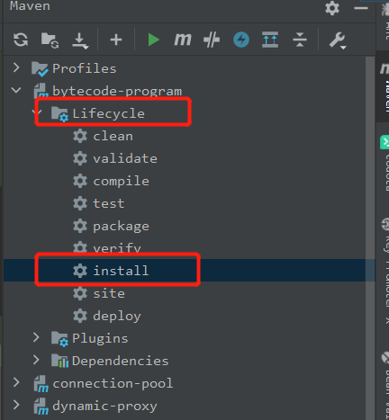
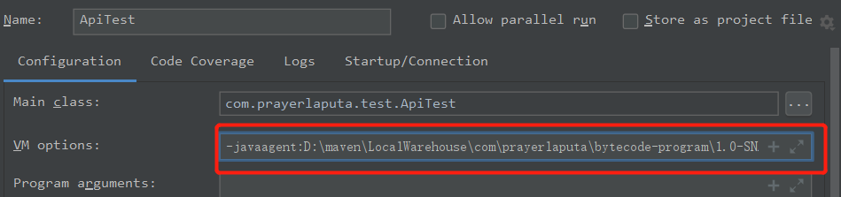

# 说明  

基于java agent + byte buddy 实现的一个非侵入链路追踪工具。  
可以参考skywalking/pinpoint等进一步优化。  

主要代码来自：https://github.com/fuzhengwei/itstack-demo-bytecode

## 说明 

需要先打包，打包时我使用的是IDEA，注意需要点Lifecycle中的install，可以包编译后并放到本地maven库中

  

点IDEA中的Plugins可能会报错，原因参见 https://blog.csdn.net/gao_zhennan/article/details/89713407

运行测试用例，注意需要在执行参数中添加-javaagent，指明agent包所在位置 

比如我用IDEA运行，就会在ApiTest执行的Config中添加参数
```text
-javaagent:你的路径/monitor-by-java-agent-1.0-SNAPSHOT.jar=传入参数
```

如图:  


